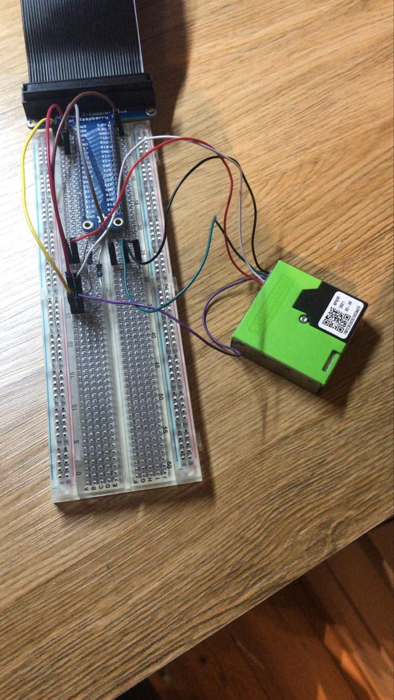
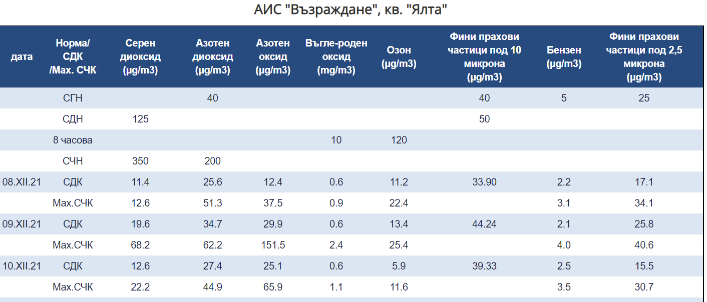
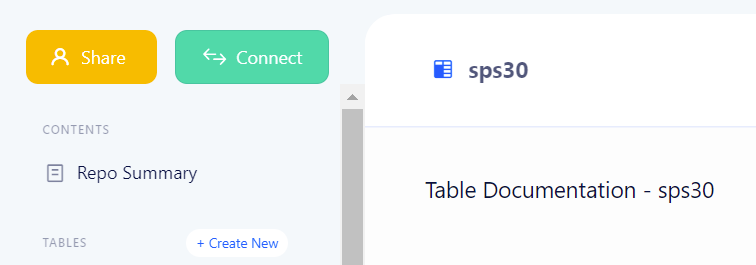
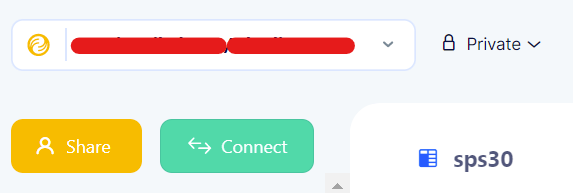
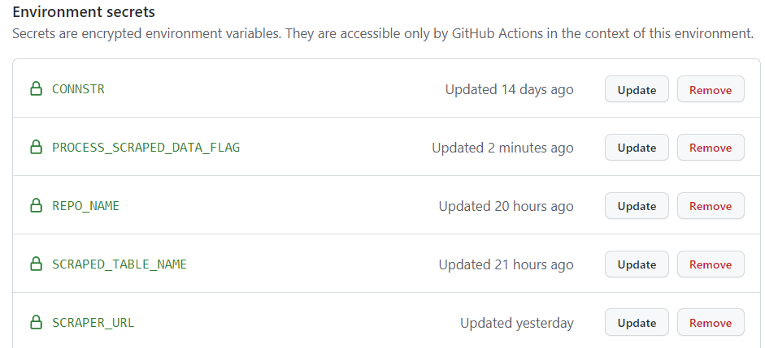

# Free Air Quality

My hometown Ruse, Bulgaria has been having issues with its air quality since the 1980s. Despite protests and calls for action by the citizens there isn't a reliable and transparent network of sensors monitoring the area. The purpose of this project is to suggest a data architecture that can track different sources of sensor data, visualize them and enable email alerting on high levels of pollution.

 

##### Limitations
The proposed solution will remain **cost free** as long as the stored data remains under 10 GB and no more than 10 GB are queried per month. Up to 3 users can have access to the Grafana dashboard (currently one admin user and one guest user).

##### Setup summary

There are two data sources in this setup:
   - **sensor data** from Sensirion SPS30 Particulate Matter sensor connected to a Raspberry Pi 4.

   - **scraped data** from the official municipality website as an html table. https://www.riosv-ruse.org/danni-punktove/stantzii
   
 

#### Recommended guidelines for replicating the setup

Aim: With this setup you can schedule a scraper of any html table online, incrementally load the contents to a DB instance and visualize them in a Grafana dashboard.
Utilizing the generous free tiers of bit.io and Grafana Cloud, this can all be done without any financial costs.

Prerequisites: 
   - bit.io account and repository
   - Grafana cloud account
   - (optional) dedicated email account for both the Grafana and bit.io, which will also serve as a guest account for Grafana and Grafana alarms recipient. That allows for separation of concerns from your personal email. 

### Stage 1: Add your template variables
1. Fork this repository
2. Copy your bit.io credentials (green Connect button):

3. Add your bit.io credentials in generate_template_variables.py
4. Copy the entire repo name to the REPO_NAME environment variable in generate_template_variables.py (format: "user/repo")

5. Provide a table name of your choice for the SCRAPED_TABLE_NAME environment and ignore the remaining table names. Set the SCRAPER_ONLY_FLAG to 'True'!
6. If you intend to ingest the html table directly without any processing, set the PROCESS_SCRAPED_DATA_FLAG to 'False'

You are now done with setting the environment variables and can **initialize your project**!

### Stage 2: Create table and prepare scraper
1. Create a virtual environment and pip install -r requirements.txt
2. Next, have a look at the columns of the html table you want to ingest. Edit create_table_scraped_data.sql fields with the corresponding columns from the table. Pay attention to the following in particular:
   - column types
   - if any further processing would be required to parse the html table (e.g unusual date format)
   - primary keys and constraints that would be meaningful
3. Run 'python initialize_project.py' in your terminal. This will execute the query you just edited and create your table in bit.io
4. Check your bit.io repo in the browser to ensure the table is there.

Next, you can add any processing logic to process_scraped_data.py process_scraped_data function. If process flag is set to False, skip this step.
Running 2_scraped_air_quality/run.py locally is a good idea at this point. It will scrape, process(if applicable) and load the html table to bit.io.

Once this step is successful we will set up the scheduled GitHub Actions process as follows

### Stage 3: Set scheduled GitHub Actions run
1. On your GitHub repository, go to Settings/Environments/Add New Environment and give it a name that should correspond to the environment field in .github/workflows/main.yml
2. Copy the following secrets from generate_template_variables.py:
    - CONNSTR
    - REPO_NAME
    - SCRAPED_TABLE_NAME
    - SCRAPER_URL
    - PROCESS_SCRAPED_DATA_FLAG
   and add them for GitHub Actions to access. Your environment should look like this:

3. Adjust the cron expression in .github/workflows/main.yml so that you can schedule the execution of the scraper at your preferred time. It is currently set to 9am UTC every day.
4. Push the changes and done.

You now have a DB that will be continuously populated with scraped data.
### Stage 4: Visualization in Grafana Cloud

1. Go to Grafana Cloud/ Data Sources/ Add data source /Postgres and enter your bit.io credentials
2. Test the connection 
3. Option 1: Click on + and create your custom dashboard based on your bit.io datasource 
3. Option 2: Import the json file from 4_grafana to reuse the visualizations from the air quality data 
