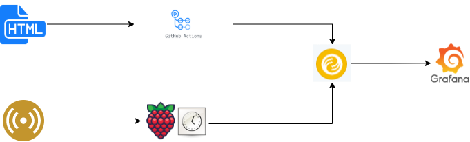

# Free Air Quality

My hometown Ruse, Bulgaria has been having issues with its air quality since the 1980s. Despite protests and calls for action by the citizens there isn't a reliable and transparent network of sensors monitoring the area. The purpose of this project is to suggest a data architecture that can track different sources of sensor data, visualize them and enable email alerting on high levels of pollution.

 

##### Limitations
The proposed solution will remain **cost free** as long as the stored data remains under 10 GB and no more than 10 GB are queried per month. Up to 3 users can have access to the Grafana dashboard (currently one admin user and one guest user).

##### Setup summary

There are two data sources in this setup:
   - **sensor data** from Sensirion SPS30 Particulate Matter sensor connected to a Raspberry Pi 4.

   - **scraped data** from the official municipality website as an html table. 

#### Recommended guidelines for replicating the setup

Aim: With this setup you can schedule a scraper of any html table online, incrementally load the contents to a DB instance and visualize them in a Grafana dashboard.
Utilizing the generous free tiers of bit.io and Grafana Cloud, this can all be done without any financial costs.

Prerequisites: 
   - bit.io account and repository
   - Grafana cloud account
   - (optional) dedicated email account for both the Grafana and bit.io, which will also serve as a guest account for Grafana and Grafana alarms recipient. That allows for separation of concerns from your personal email. 

1. Fork this repository
2. Copy your bit.io credentials (green Connect button):

3. Add your bit.io credentials in generate_template_variables.py
4. Copy the entire repo name to the REPO_NAME environment variable in generate_template_variables.py (format: "user/repo")

5. Basic use case: If you intend to only use the scraper functionality, provide a table name of your choice for the SCRAPED_TABLE_NAME environment and ignore the remaining table names. Set the SCRAPER_ONLY_FLAG to 'True'!
  - If you intend to add your sensor data...
  - If you intend to visualize the locations of the monitoring stations...
  - If you intend to visualize thresholds...
6. If you intend to ingest the html table directly without any processing, set the PROCESS_SCRAPED_DATA_FLAG to 'False'

You are now done with setting the environment variables and can initialize your project!
1. Create a virtual environment and pip install -r requirements.txt
2. Run 'python initialize_project.py' in your terminal. This will create (and wherever needed populate) your tables in bit.io
3. Check your bit.io repo in the browser to ensure the table(s) are there

